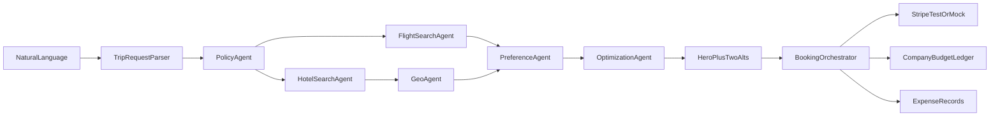
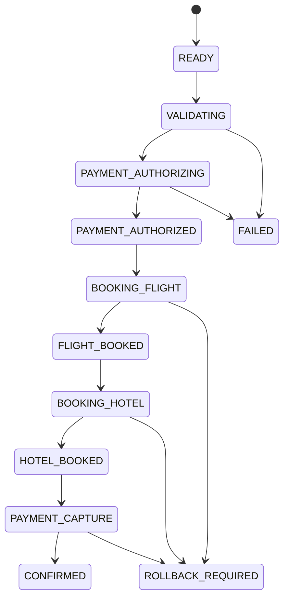

# Enterprise AI Travel Expense Agent

> **For agentic workers:** REQUIRED SUB-SKILL: Use superpowers:subagent-driven-development (recommended) or superpowers:executing-plans to implement this plan task-by-task. Steps use checkbox (`- [ ]`) syntax for tracking.

**Using:** obra Superpowers `writing-plans` (spec already supplied by the user; this is architectural, not bounded). **Ponytail:** implement only requested abstractions, fewest files, mock adapters when credentials are missing, one runnable check per non-trivial domain module.

**Goal:** Ship a live-demoable app in this repo so an employee can say where they need to go, see one policy-aware itinerary, book it on Acme’s TEST Visa, and an admin can see the expense, budget, and a policy suggestion.

**Architecture:** Next.js App Router + server actions. MongoDB (native driver) is the source of truth for people, policy, hotels (GeoJSON + `$near`), bookings, expenses, and the company ledger. A single agent pipeline streams UI steps; money, distance, policy, and booking are deterministic code. The LLM only parses language and writes copy. Stripe TEST MODE (or a mock that follows the same state machine) never takes a price from the browser.

**Tech stack:** Next.js 15+ App Router, TypeScript, Tailwind, shadcn/ui, Lucide, Framer Motion, Recharts, `mongodb`, Stripe test SDK, OpenAI-compatible client behind an adapter.

**Spec:** User build prompt (save on implementation start as [`docs/superpowers/specs/2026-08-13-travel-expense-agent-design.md`](docs/superpowers/specs/2026-08-13-travel-expense-agent-design.md)). Plan file to save as [`docs/superpowers/plans/2026-08-13-travel-expense-agent.md`](docs/superpowers/plans/2026-08-13-travel-expense-agent.md). Copy Ponytail into [`.cursor/rules/ponytail.mdc`](.cursor/rules/ponytail.mdc) (it is not in the repo today).

**Repo today:** [`/Users/mawer/mongodbSprint/TravelAgent`](/Users/mawer/mongodbSprint/TravelAgent) contains only [`README.md`](README.md). Nothing to preserve besides that file.

## Global constraints

- `DEMO_MODE=true` makes search, ranking, and Stripe deterministic for the scripted Vegas query.
- Never trust a client-sent price; reload itinerary server-side before charge.
- LLM never calls Stripe or mutates the ledger.
- Stripe TEST MODE only; never store PANs; demo card is Visa `4242`.
- Company budget lives in MongoDB (`companyBudgetLedger`), not Stripe balance.
- Distance comes from geo logic (`$near` / haversine), never from the model.
- Policy validation is deterministic; the model may explain, not invent compliance.
- Semantic color only: green compliant, amber exception, red out of policy.
- No purple AI gradients; no Kayak-style result grids.
- Ponytail: no extra auth product, no Mongoose, no agent framework, no queue.

## Ponytail decisions (locked)

- **Native `mongodb` driver**, not Mongoose (geo + vector indexes are first-class).
- **No login product.** Hardcoded demo session: Alex Morgan / Acme Technologies.
- **Agents are named functions in one module**, not 10 class files. Spec names are preserved as exports.
- **Vector Search is an interface.** DEMO_MODE uses a small feature vector + cosine. If Atlas vector index exists, the same function can call `$vectorSearch`. UI shows `Preference match: 94%`, never raw arrays.
- **Stripe keys optional.** `TestStripeAdapter` if `STRIPE_SECRET_KEY` is set; otherwise `MockStripeAdapter` with the same states. Mark with `ponytail:` comment and upgrade path.
- **LLM optional.** `DemoLlmAdapter` returns the scripted parse/explanations for the MongoDB.local prompt so the talk never depends on an API.
- **Home vs demo-script conflict:** seed does **not** pre-book Vegas. Home starts with the command box (and optional empty upcoming). After booking, the spec’s “Booked · In policy / $1,084 / 0.3 mi” card appears. That is the only way the 19-step script works.

## File map

```text
.cursor/rules/ponytail.mdc
docs/superpowers/specs/2026-08-13-travel-expense-agent-design.md
docs/superpowers/plans/2026-08-13-travel-expense-agent.md
.env.example
src/types/index.ts
src/lib/db/client.ts              # Mongo singleton
src/lib/db/indexes.ts             # 2dsphere + optional vector index
src/lib/db/seed.ts
src/lib/session.ts                # Alex / Acme demo session
src/lib/money.ts                  # integer cents only
src/lib/policy.ts                 # deterministic rules
src/lib/geo.ts                    # $near + miles conversion
src/lib/vector.ts                 # preferenceSimilarity
src/lib/ranking.ts                # weighted finalScore + breakdown
src/lib/providers/flights.ts      # FlightProvider + MockFlightProvider
src/lib/providers/hotels.ts
src/lib/llm.ts                    # OpenAI-compatible + DemoLlmAdapter
src/lib/stripe.ts                 # TEST / mock adapter
src/lib/booking.ts                # BookingOrchestrator + state machine
src/lib/agents.ts                 # pipeline + activity events
src/app/globals.css               # warm neutrals, tokens
src/app/layout.tsx
src/app/page.tsx                  # Home
src/app/agent/page.tsx
src/app/trips/page.tsx
src/app/trips/[id]/page.tsx
src/app/expenses/page.tsx
src/app/policy/page.tsx
src/app/insights/page.tsx
src/app/profile/page.tsx
src/app/settings/page.tsx
src/app/actions/*.ts              # search, book, policy, feedback, seed
src/components/layout/app-shell.tsx
src/components/agent/*            # command box, activity stream, rec card
src/components/booking/*          # confirm modal, progress, success
src/components/ui/*               # shadcn only as needed
scripts/seed.ts
src/lib/policy.test.ts            # one check per domain (ponytail)
src/lib/geo.test.ts
src/lib/ranking.test.ts
src/lib/booking.test.ts
```

## Runtime split



LLM-assisted: parse, “Why this trip?”, PDF/survey extraction copy, preference inference copy, insight copy.

Deterministic only: price reload, policy pass/fail, `$near` distance, Stripe, booking states, budget math.

**Ranking (debug panel only for weights):**

`finalScore = policyCompliance * 0.35 + preferenceSimilarity * 0.25 + proximityScore * 0.20 + priceScore * 0.10 + historicalFeedbackScore * 0.10`

Vegas scripted result: 96% match, United nonstop SFO–LAS 9:10–10:42, Hilton $246/night, 0.3 mi, total **$1,084**, allowance **$1,280**, **$196** under. Alternatives: Lowest cost American+Hyatt $912 / 87%; Best location United+Marriott $1,146 / 94% / 0.1 mi.

## Data model (Mongo collections)

`organizations`, `employees`, `employeeProfiles`, `travelPolicies`, `tripRequests`, `tripCandidates`, `bookings`, `paymentAttempts`, `expenses`, `feedback`, `policySuggestions`, `companyBudgetLedger`, plus `hotels` and `venues` for geo seed.

Hotels:

```ts
location: { type: "Point"; coordinates: [lng, lat] } // 2dsphere
```

Money stored as **integer cents**. Ledger: `annualBudget`, `spent`, `reserved`, `available`. Seed: annual `$100,000`, spent `$40,496`, available `$58,420` (plus `$1,084` reserved/spent after the demo booking).

Seed people: Alex Morgan (SFO, United, aisle, Hilton, proximity-first, 91% confidence, 14 trips / 9 feedback), Jordan Lee, Priya Shah, Marcus Johnson. Cities: SF, NYC, LAS, Austin, Chicago, Seattle, London. Policy friction on SF/NYC hotel caps so Insights has a real SF $250 → suggest $295 card.

Policy already Active from `Acme_Travel_Policy_2026.pdf` (seeded extracted rules; upload UI simulates the 5-step ingest).

## Demo-critical UX

Left shell: Home, Ask Travel Agent, Trips, Expenses, Company Policy, Insights, Profile. Bottom: Acme switcher, Alex avatar, Settings.

1. **Home** — “Good afternoon, Alex” / “Where do you need to be next?” / command box / chips (NYC next week, Conference travel, Customer visit, Team offsite). Upcoming card only after booking.
2. **Ask Travel Agent** — paste the Vegas prompt → 6-step activity stream (Understanding trip → Policy → Flights 24 → Hotels 46/12 in radius → Preferences → Optimizing) → hero 96% card + Why this trip + Book CTA + See alternatives.
3. **Book** — modal: SFO→LAS, flight $346, hotel $738, total $1,084, Acme Corporate Travel •••• 4242 TEST MODE, “No personal payment required.” Confirm runs orchestrator.
4. **Orchestrator states:** READY → VALIDATING → PAYMENT_AUTHORIZING → PAYMENT_AUTHORIZED → BOOKING_FLIGHT → FLIGHT_BOOKED → BOOKING_HOTEL → HOTEL_BOOKED → PAYMENT_CAPTURE → CONFIRMED (FAILED / ROLLBACK_REQUIRED on error). Idempotency via `bookingAttemptId`.
5. **Success:** “You’re booked.” UA7X92L / HLT83291 / $1,084 charged / TEST MODE / View trip · Done. Budget remaining animates `$58,420` → `$57,336`.
6. **Trips / Expenses** — new booking; air $346 + lodging $738; Automatically classified / Compliant / no reimbursement.
7. **Policy / Profile / Insights** — imported PDF rules; Travel DNA; SF hotel-cap suggestion (Review / Dismiss only — never auto-apply).



## Env

```bash
DEMO_MODE=true
MONGODB_URI=
MONGODB_DB=travel_agent
STRIPE_SECRET_KEY=                         # optional test key
STRIPE_PUBLISHABLE_KEY=
OPENAI_BASE_URL=                           # optional
OPENAI_API_KEY=
```

Missing Stripe/OpenAI → mock adapters, demo still runs. Missing Mongo → seed/search fail loudly (this is a MongoDB sprint; do not fake the database).

## Implementation slices

Each slice is independently demoable. Prefer one domain test file per slice that has logic (ponytail: no test frameworks required beyond `node:test` or the project’s default).

### Slice 1 — Scaffold, design system, shell

- `create-next-app` in this repo (TypeScript, App Router, Tailwind, `src/`).
- shadcn init (neutral, large radius). Tokens: warm off-white canvas, white cards, subtle borders, semantic status pills.
- Copy Ponytail rule; write spec + this plan under `docs/superpowers/`.
- [`src/components/layout/app-shell.tsx`](src/components/layout/app-shell.tsx) with the seven nav items + org/user footer.
- Stub routes so every nav target exists.
- [`src/lib/session.ts`](src/lib/session.ts): Alex Morgan, Senior Software Engineer, San Francisco, SFO.

### Slice 2 — Types, Mongo, seed

- [`src/types/index.ts`](src/types/index.ts) for all collections.
- Singleton client + `ensureIndexes()` (`2dsphere` on `hotels.location`; vector index no-op with `ponytail:` if Atlas search is unavailable).
- Seed Acme policy, 4 employees, ~14–20 past trips, feedback, SF/NYC friction, Vegas venue + hotels with real-ish lat/lng, ledger $58,420 available.
- `npm run seed`.

### Slice 3 — Home + conversational search + recommendations

- Command box, chips, activity stream (Framer Motion, fast).
- [`src/lib/agents.ts`](src/lib/agents.ts) emits the six demo steps then returns ranked candidates.
- `DemoLlmAdapter` maps the scripted Vegas utterance to `{ origin: SFO, dest: LAS, dates, venue: MongoDB.local, airlinePref: United, proximity: true }`.
- Hero card + two alternatives + Why this trip + debug score breakdown behind a small “Developer” disclosure (employees see chips only).

### Slice 4 — Policy, geo, vector, ranking

- [`src/lib/policy.ts`](src/lib/policy.ts): economy <6h, hotel caps, conference 1 mi, 15% conference bump, $2500 manager approval. Returns structured pass/fail used by ranking — not LLM prose.
- [`src/lib/geo.ts`](src/lib/geo.ts): `findHotelsNear({ coordinates, maxDistanceMeters })` via `$near` / `$geometry` / `$maxDistance`. UI string from meters: `0.3 mi from venue`.
- [`src/lib/vector.ts`](src/lib/vector.ts) + [`src/lib/ranking.ts`](src/lib/ranking.ts). Pipeline order: generate candidates → policy filter → geo filter → similarity → rank. Seeded Vegas path must hit 96% / 0.3 mi / $196 under.

### Slice 5 — Stripe + BookingOrchestrator + success

- [`src/lib/booking.ts`](src/lib/booking.ts): reload candidate by id → inventory → reprice → policy → ledger check → PaymentIntent → mock book flight/hotel → capture → save booking → expenses → decrement ledger. `bookingAttemptId` unique index.
- Confirmation modal → progress checkmarks → “You’re booked.”
- Never pass `amount` from the client as the charge source.

### Slice 6 — Trips, expenses, policy, profile, feedback, insights

- Trips: Upcoming / Past / Cancelled; itinerary timeline on `[id]`.
- Expenses auto-created in slice 5; page lists classified lines.
- Policy page: Active PDF source, upload simulation (5 steps), extracted rule cards; empty-org survey only if `travelPolicies` is empty (Acme seed is not empty).
- Profile: Travel DNA + manual edit of airlines/seat/hotels/home airport.
- Past trips: star ratings + “Did policy make this harder?”; FeedbackAgent updates profile aggregates.
- Insights: SF hotel-cap suggestion card + Recharts for spend, compliance, destinations, avg flight/hotel, exception rate, satisfaction, savings, hotel distance, airline mix. Review/Dismiss only.

### Slice 7 — Polish and freeze the 19-step script

- Loading / empty / error states; responsive shell (sidebar collapses).
- Run the exact demo script; freeze seeded ids (`org_acme`, `emp_alex`, `venue_mdb_local_vegas`, `candidate_vegas_hero`) so the talk cannot drift.
- If Stripe/OpenAI keys appear later, adapters swap without UI changes.

## Spec coverage (self-review)

Home, agent stream, hero+alts, policy PDF+survey, profile, vector abstraction, ranking weights, geo `$near`, Stripe TEST modal, orchestrator states, booking animation, trips, expenses, ledger, feedback, insights/charts, seed people/cities, provider interfaces, agent names, collections, safety rules, DEMO_MODE, implementation order — all mapped to slices 1–7. Out of scope unless asked: real Duffel/Amadeus, real auth, live Atlas Vector Search index creation in CI, production Stripe.

## Execution handoff

After plan approval: copy Ponytail + spec into the repo, then implement slice 1.

Two options:

1. **Subagent-Driven (recommended)** — fresh subagent per slice, review between slices.
2. **Inline Execution** — this session, `executing-plans`, checkpoint after each slice.
